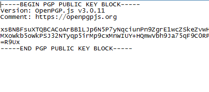
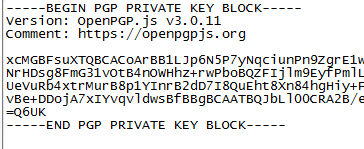

## Case Study - PGP Encryption

### Warning - you do not need to know about PGP to understand.  The purpose of this exercise is to understand what is happening to the code at a high-level.

You and a friend want to send messages over the internet, but you do not want to send them clear text because you are paranoid about people seeing your messages.

So to combat this, you made a createkeys.js to encrypt and decrypt messages.  The only thing to know at this point is these ensure the security of messages.  

This example requires you to know
- how to run a node program
- process.argv

Take a look at the file and try to understand what is going on from a high level.  Note the if statement and what is required.  Try to run this code and observe the folder and any new files that may pop up.

If done correctly, you should get something similar to the two images below

The answer that they should be getting is

node createkeys.js "name" "passphrase" privatekey publickey

They should be observing that the program creates two files privatekey.txt and publickey.txt.  

Those that didn't get the desired result should review 10.1

All credit goes to:
- [Another Webdev blog](https://blog.castiel.me/posts/003-play-with-cryptography-with-openpgpjs.html) to go further into cryptography

